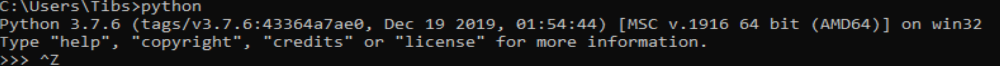
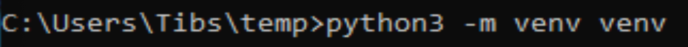
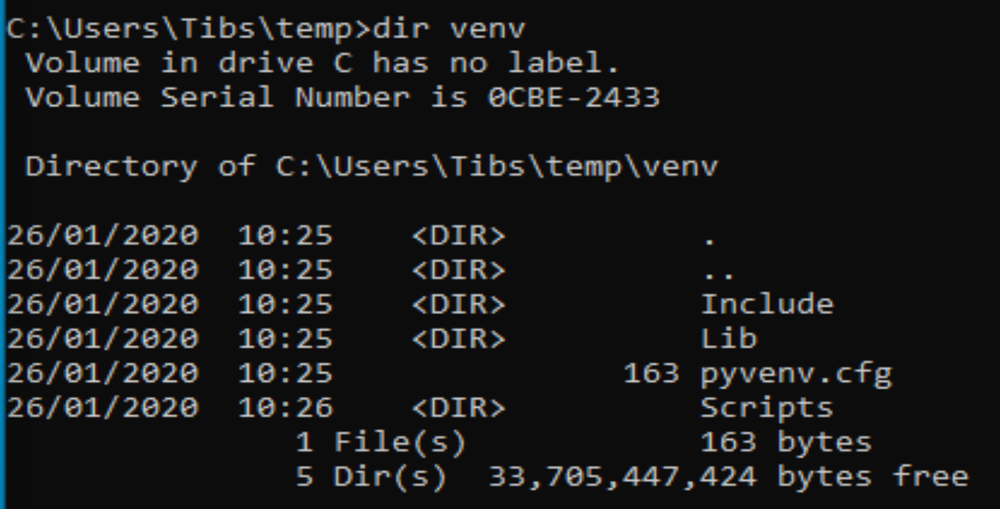
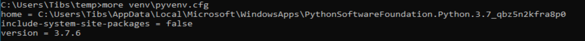
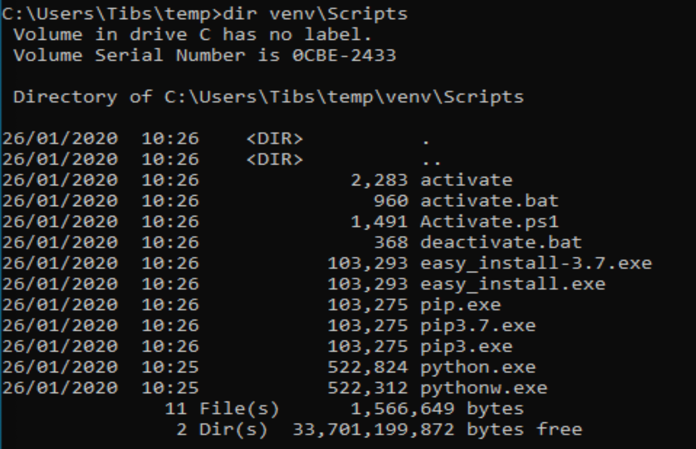
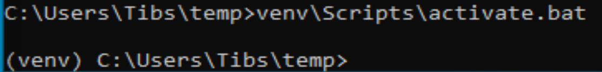
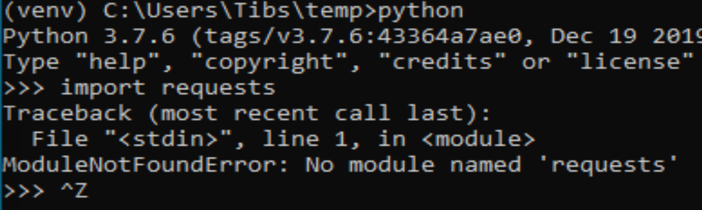
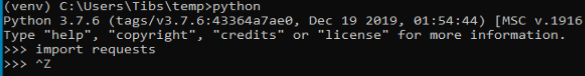
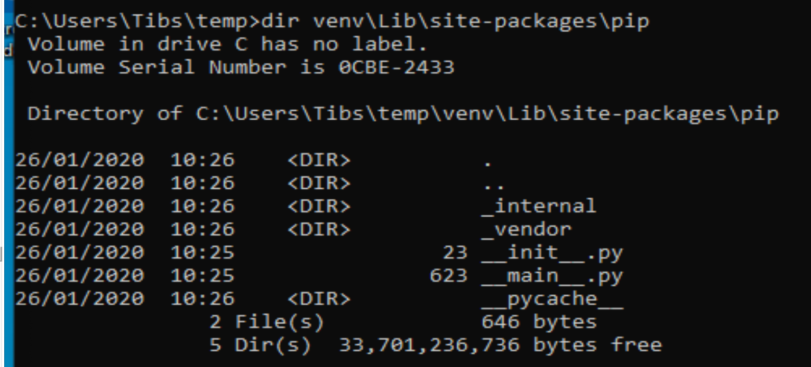
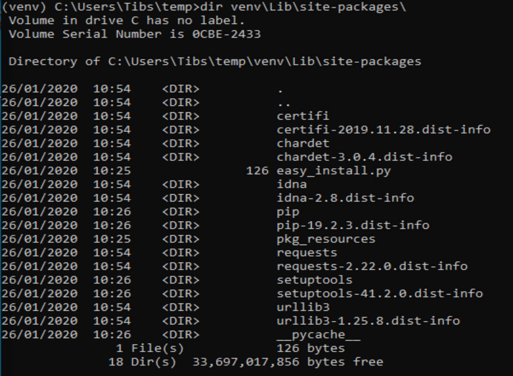

==============================================
An introduction to Python virtual environments
==============================================

.. contents::
   
Why do we need virtual environments
===================================

Shouldn't alter the system Python
---------------------------------

Sometimes the Python provided by your operating system is actually acceptable.
This can, for instance happen with Linux systems, where you might be quite
happy with the version of Python installed by the system package mechanisms.

And if you're happy only using software that can be installed by this route
(e.g., by ``apt-get`` or ``yum`` or whatever), then you *could* argue that you
don't need virtual environments.

However, in practice you are eventually likely to want to install something
more recent that your operating system provides, or perhaps a package that the
operating system tools don't make available.

The thing to remember here is:

  Don't mix installing things by the operating system mechanisms and the
  language-specific mechanisms.

In other words, if you have an OS installed Python, don't try to update it
using ``pip``.

Luckily, most systems make this hard (on Linux you'd typically need to use
``sudo``), which is a good hint not to do it!

Why not, though?

There are three reasons:

Firstly, it's quite possible that the OS itself is using that version of
Python, and if you change what is installed, you may break the things the OS
relies on. This is hard to detect beforehand.

Secondly, OS packaging solutions keep a record of what they have installed, so
they can correctly update or remove packages. If you "go behind their back",
their recorded knowledge will be wrong, which can lead to problems when trying
to upgrade.

Thirdly, it still doesn't help with the "need for different versions for
different purposes" problem, that we will get to later on.

Can't alter the available Python
--------------------------------

Sometimes the person managing your computer doesn't let you alter the
available Python libraries. This may be for company legal reasons, or
whatever.

    Note that ``pip`` *does* actually let you install packages into a
    user-local directory, but that relies on your remembering to do it,
    and there's no obvious visibility that this has been done. And it still
    doesn't addresss the "need for different versions" problem.

Even if you could subvert that, you probably shouldn't.

You want to work on two programs that have conflicting dependencies
-------------------------------------------------------------------

This is the crux of it.

If you are working on existing packages, installed via ``pip``, then they will
automatically install their dependencies. But sometimes two packages depend on
mutually incompatible things - typically, different versions of a package or
set of packages.

So if project A needs versions 1 through 3 of a package, but won't work with 4
or higher, and project B needs at least version 5, then there is a problem
running them both at the same time.

Virtual environments are designed to make it easy to handle this, and also
relatively obvious that you are doing so.

Managing dependencies
---------------------

A virtual environment lets you be explicit about what you have installed, and
that makes it easier to produce a proper package when you're developing.

``pip freeze`` and ``pipdeptree``

But also, tidiness
------------------

Let us not also forget that we might want to keep things tidy.

If I'm working on project A, I might have a set of dependencies to do with,
perhaps, documentation tools, whereas for project B I need things for machine
learning, and for project C web development. Each of those can imply a large
number of Python packages (particularly the machine learning case), which
don't overlap much. There's no particular reason to have the unnecessary
packages available, and if we constrain our workspace a bit, it makes it
easier to reason about problems when they do occur.

What about upgrading Python?
----------------------------

Virtual environments don't help directly (with upgrading Python and "losing"
the installed packages), but pipenv (check?) and poetry can.

Actual use cases
----------------

At our January meeting, we were told about ``pypercard``, which is a very nice
package, but has quite a few dependencies. If I want to play with it, then I
probably don't want to "splash" those dependencies all over my normal working
environment, especially if I'm also doing actual work with Python.

At work, we had two Pyton programs we needed to use in our build chain, but
they had incompatible version requirements of support libraries. The solution
was to use a different virtual environment for each.

Also at work, we wanted to know exactly which packages were needed for a
particular project. Again, running in a virtual environment meant we could
easily list the required packages, what version we had installed, and what
packages had been installed automatically as dependencies of other packages.

The Examples
============

In general, where I say "unix", that should include most common Linux
distributions, and also the BSDs and Mac OS. I assume your shell is something
like bash or zsh or even fish. For Windows, I assume Windows 10, and I assume
your shell is CMD.EXE or Powershell - I believe either should be OK. My
experience is more limited for Windows, but I shall include actual
screenshots.

The unix examples are from my Mac at home. The text is cut-and-pasted from
my terminal.

When you see ``tibs ~$`` (or something similar) at the start of a line, that
is my prompt - everything up to the ``$``. So if you're following along, only
type the stuff after the ``$`` (and the space that follows it).

For Windows, I've run Windows 10 in a virtual machine, and made screenshots.
Apologies for those - this seemed the simplest way to do it. I'll mostly only
talk about Windows when I'm talking about its differences from unix.

I *have* tried all the ``venv`` examples on Windows, and I've installed and
checked poetry_.

``python3 -m venv``
===================

We're going to start by looking at the "official" way of creating and using
virtual environments, as of Python 3.3.

But first some preparation.

Make a working directory
------------------------

First, I make a directory to work in, and move there:

.. code:: bash

  tibs ~$ mkdir temp
  tibs ~$ cd temp
  tibs ~/temp$

Check what Python(s) we have available
--------------------------------------

Let's find out what version of Python I'm running - on my machine:

.. code:: bash

  tibs ~/temp$ python --version
  Python 2.7.17
  tibs ~/temp$ python3 --version
  Python 3.7.6

I can investigate that a bit further:

.. code:: bash

  tibs ~/temp$ which python
  /usr/local/bin/python
  tibs ~/temp$ which python3
  /usr/local/bin/python3

As it happens, I installed the Python 3 myself, deliberately, and the Python 2
has been installed as a depencency of something else (otherwise I wouldn't
have bothered).

  My Mac does provide its own version of Python 2, but if I run it I get a
  warning:

  .. code:: bash

    tibs ~/temp$ /usr/bin/python

    WARNING: Python 2.7 is not recommended.
    This version is included in macOS for compatibility with legacy software.
    Future versions of macOS will not include Python 2.7.
    Instead, it is recommended that you transition to using 'python3' from within Terminal.

    Python 2.7.16 (default, Nov  9 2019, 05:55:08)
    [GCC 4.2.1 Compatible Apple LLVM 11.0.0 (clang-1100.0.32.4) (-macos10.15-objc-s on darwin
    Type "help", "copyright", "credits" or "license" for more information.
    >>> ^D

Create a virtual environment
----------------------------

To create a new virtual environment with Python 3, I just need to do:

.. code:: bash

  tibs ~/temp$ python3 -m venv venv

and now if I look, I've got a new directory called ``venv``.

.. code:: bash

  tibs ~/temp$ ls
  venv

Before going any further, let's unpack that command line a bit.

* ``python3`` is the Python I want to use to create the new virtual
  environment. If I wanted to be specific about exactly which Python I wanted,
  and assuming I've got them both installed, I could do:

  .. code:: bash

    $ python3.6 -m venv venv36

  or:

  .. code:: bash

    $ python3.7.1 -m venv venv371

* ``-m venv`` tells Python to load the ``venv`` module and run it.

  The Python standard library comes with several modules that you can run in
  this way. They all end with code like:

  .. code:: python

    if __name__ == '__main__':
        do_something()

  In the case of ``venv.py``, that "do something" is to create the setup for a
  virtual environment for this particular Python.

* ``venv`` is the name of the directory to create which will hold the
  "workings" of the virtual environment. I'll talk about how to choose a name
  for this directory, and where to put it, later on, but for now the name
  ``venv`` is fairly self-explanatory, and the default place, the current
  directory, is what we want.

Activate the virtual environment
--------------------------------

Now, *creating* that directory hasn't done anything else. In particular, it
hasn't activated the virtual environment.

  I am embarrased to acknowledge how many times I've forgotten that!

The next thing we need to do differs slightly depending on what shell we are
using. For bash and zsh, it's simply:

.. code:: bash

   tibs ~/temp$ source venv/bin/activate

If you're old fashioned and use csh, then you should do:

.. code:: bash

   tibs ~/temp$ source venv/bin/activate.csh

and if you use fish (as I do) then you do

.. code:: bash

   tibs ~/temp$ source venv/bin/activate.fish
   
Note that it **will not work** to do:

.. code:: bash

   tibs ~/temp$ venv/bin/activate

even though that *sounds* more sensible.

  I always write the activation command using ``source``, even though most
  shells also allow abbreviating that to ``.`` (dot / period). Since it's hard
  enough to remember that it needs to be sourced, I prefer the longer/more
  obvious form.

On Windows, if you're using CMD.EXE, you do::

  > venv\Scripts\activate.bat

and if you're using Powershell you do::

  PS > venv\Scripts\Activate.ps1

..

  Yes, windows works differently, so there's no equivalent to
  ``source``. Which is nice.

In all cases, the next prompt should now start with ``(venv)`` - that is, the
name of the virtual environment directory, in parentheses.

For instance, in my case::

.. code:: bash

  tibs ~/temp$ source venv/bin/activate.fish
  (venv) tibs ~/temp$

Working in a virtual environment
--------------------------------

So our prompt now says::

.. code:: bash

  (venv) tibs ~/temp$

or something like that. What does that give us?

Well, the first thing is to make it more obvious what Python we're using.
Specifically:

.. code:: bash

  (venv) tibs ~/temp$ python3 --version
  Python 3.7.6
  (venv) tibs ~/temp$ python --version
  Python 3.7.6

That is, the ``python3`` command gives us Python 3.7.6, the Python we used to
create the venv, but now the ``python`` command does as well.

We'll go into why that is later on, but for the moment, it's enough to notice
that both of those commands point "inside" the virtual environment directory:

.. code:: bash

  (venv) tibs ~/temp$ which python3
  /Users/tibs/temp/venv/bin/python3
  (venv) tibs ~/temp$ which python
  /Users/tibs/temp/venv/bin/python

not to the "original" locations.
   
...and actually, the same has been done for ``pip`` and ``pip3`` as well,
which makes of new packages installation just that bit easier.

Deactivating a virtual environment
----------------------------------

Whatever shell or OS you are using, you just use the ``deactivate`` command to
deactivate it:

.. code:: bash

  (venv) tibs ~/temp$ deactivate
  tibs ~/temp$

Using our virtual environment
-----------------------------

So let's install something into our virtual environment.

First, we need to remember to re-activate it:

.. code:: bash

  tibs ~/temp$ source venv/bin/activate.fish
  (venv) tibs ~/temp$

and then we can install a package. I shall choose ``requests`` - this is
actually a package that has caused me dependency clashes at work in the past,
even though it's generally very well behaved.

.. code:: bash

  (venv) tibs ~/temp$ pip install requests
  Collecting requests
    Using cached https://files.pythonhosted.org/packages/51/bd/23c926cd341ea6b7dd0b2a00aba99ae0f828be89d72b2190f27c11d4b7fb/requests-2.22.0-py2.py3-none-any.whl
  Collecting idna<2.9,>=2.5 (from requests)
    Using cached https://files.pythonhosted.org/packages/14/2c/cd551d81dbe15200be1cf41cd03869a46fe7226e7450af7a6545bfc474c9/idna-2.8-py2.py3-none-any.whl
  Collecting urllib3!=1.25.0,!=1.25.1,<1.26,>=1.21.1 (from requests)
    Downloading https://files.pythonhosted.org/packages/e8/74/6e4f91745020f967d09332bb2b8b9b10090957334692eb88ea4afe91b77f/urllib3-1.25.8-py2.py3-none-any.whl (125kB)
      |||||||||||||||||||||||||||||||||| 133kB 2.6MB/s
  Collecting certifi>=2017.4.17 (from requests)
    Using cached https://files.pythonhosted.org/packages/b9/63/df50cac98ea0d5b006c55a399c3bf1db9da7b5a24de7890bc9cfd5dd9e99/certifi-2019.11.28-py2.py3-none-any.whl
  Collecting chardet<3.1.0,>=3.0.2 (from requests)
    Using cached https://files.pythonhosted.org/packages/bc/a9/01ffebfb562e4274b6487b4bb1ddec7ca55ec7510b22e4c51f14098443b8/chardet-3.0.4-py2.py3-none-any.whl
  Installing collected packages: idna, urllib3, certifi, chardet, requests
  Successfully installed certifi-2019.11.28 chardet-3.0.4 idna-2.8 requests-2.22.0 urllib3-1.25.8
  WARNING: You are using pip version 19.2.3, however version 20.0.2 is available.
  You should consider upgrading via the 'pip install --upgrade pip' command.

Anyway, that's also given us some good advice. When we create a virtual
environment, it puts a version of ``pip`` into it for us, but it only knows
about the version that comes with that version of Python.

  Interesting aside: you can do ``python3 -m pip`` to use that specific ``pip``

Anyway, it's telling us there is a more recent version of ``pip``, and
generally we want to use the most recent version, so let's update it as we
were told:

.. code:: bash

  (venv) tibs ~/temp$ pip install --upgrade pip
  Collecting pip
    Downloading https://files.pythonhosted.org/packages/54/0c/d01aa759fdc501a58f431eb594a17495f15b88da142ce14b5845662c13f3/pip-20.0.2-py2.py3-none-any.whl (1.4MB)
      |||||||||||||||||||||||||||||||||| 1.4MB 2.8MB/s
  Installing collected packages: pip
    Found existing installation: pip 19.2.3
      Uninstalling pip-19.2.3:
        Successfully uninstalled pip-19.2.3
  Successfully installed pip-20.0.2

Let's check what we've done:

.. code:: bash

  (venv) tibs ~/temp$ pip --version
  pip 20.0.2 from /Users/tibs/temp/venv/lib/python3.7/site-packages/pip (python 3.7)

and to prove we've got the ``requests`` package installed:

.. code:: bash

  (venv) tibs ~/temp$ python
  Python 3.7.6 (default, Jan 28 2020, 22:16:20)
  [Clang 11.0.0 (clang-1100.0.33.16)] on darwin
  Type "help", "copyright", "credits" or "license" for more information.
  >>> import requests
  >>>

.. code:: bash

  (venv) tibs ~/temp$ deactivate
  tibs ~/temp$

As you can see, this puts the prompt back to normal as well.

And now we're back to the versions of Python outside the virtual environment:

.. code:: bash

  tibs ~/temp$ python --version
  Python 2.7.17
  tibs ~/temp$
  tibs ~/temp$ pip --version
  pip 19.3.1 from /usr/local/lib/python2.7/site-packages/pip (python 2.7)
  tibs ~/temp$
  tibs ~/temp$ python3
  Python 3.7.6 (default, Jan 28 2020, 22:16:20)
  [Clang 11.0.0 (clang-1100.0.33.8)] on darwin
  Type "help", "copyright", "credits" or "license" for more information.
  >>> import requests
  Traceback (most recent call last):
    File "<stdin>", line 1, in <module>
  ModuleNotFoundError: No module named 'requests'
  >>>

In other words, the changes we made in the virtual environment have "gone
away".

And, if we reactivate, they will "come back" again.

How it works
============

(what is in the ``venv`` directory)

.. code:: bash

  tibs ~/temp$ ls -F venv
  bin/        include/    lib/        pyvenv.cfg

.. code:: bash

  tibs ~/temp$ more venv/pyvenv.cfg
  home = /usr/local/bin
  include-system-site-packages = false
  version = 3.7.6

.. code:: bash

  tibs ~/temp$ ls -F venv/bin/
  activate          chardetect*       pip*              python@
  activate.csh      easy_install*     pip3*             python3@
  activate.fish     easy_install-3.7* pip3.7*

.. code:: bash

  tibs ~/temp$ ls -l venv/bin/python
  lrwxr-xr-x  1 tibs  staff  7 19 Jan 16:50 venv/bin/python -> python3
  tibs ~/temp$ ls -l venv/bin/python3
  lrwxr-xr-x  1 tibs  staff  22 19 Jan 16:50 venv/bin/python3 -> /usr/local/bin/python3

.. code:: bash

  tibs ~/temp$ ls venv/include

.. code:: bash

  tibs ~/temp$ ls -F venv/lib
  python3.7/
  tibs ~/temp$ ls -F venv/lib/python3.7
  site-packages/

.. code:: bash

  tibs ~/temp$ ls -F venv/lib/python3.7/site-packages
  __pycache__/                  pip-20.0.2.dist-info/
  certifi/                      pkg_resources/
  certifi-2019.11.28.dist-info/ requests/
  chardet/                      requests-2.22.0.dist-info/
  chardet-3.0.4.dist-info/      setuptools/
  easy_install.py               setuptools-41.2.0.dist-info/
  idna/                         urllib3/
  idna-2.8.dist-info/           urllib3-1.25.8.dist-info/
  pip/

By contrast, if I create another virtual environment (``venv2``) and don't
install anything in it, *its* ``venv2/lib`` looks like:

.. code:: bash

  tibs ~/temp$ ls -F venv2/lib/python3.7/site-packages/
  __pycache__/                    pkg_resources/
  easy_install.py                 setuptools/
  pip/                            setuptools-41.2.0.dist-info/
  pip-19.2.3.dist-info/

Finding out what is installed
=============================

``pip freeze``
--------------

Back in the original virtual environment, after installing ``requests``:

.. code:: bash

  tibs ~/temp$ source venv/bin/activate.fish
  (venv) tibs ~/temp$ pip freeze
  certifi==2019.11.28
  chardet==3.0.4
  idna==2.8
  requests==2.22.0
  urllib3==1.25.8

It's called ``freeze`` because this command is originally intended for
creating a file listing exactly the package versions installed. ``pip`` can
then be given that text file and reproduce the same installation.

So, for instance:

.. code:: bash

  (venv) tibs ~/temp$ pip freeze > requirements.txt

and then elsewhere, use the same ``requirements.txt`` file:

.. code:: bash

  (venv) tibs ~/temp$ pip install -r requirements.txt

``pipdeptree``
--------------

https://github.com/naiquevin/pipdeptree
and https://pypi.org/project/pipdeptree/

This is a very useful package for showing what is installed, and why (i.e.,
what package needed another package). It can also be very useful for
diagnosing problems (for instance, if the dependency resolution of ``pip``
gets confused and it can't work out what versions of what it needs).

.. code:: bash

  tibs ~/temp$ source venv/bin/activate.fish
  (venv) tibs ~/temp$ pip install pipdeptree
  Collecting pipdeptree
    Downloading pipdeptree-0.13.2-py3-none-any.whl (16 kB)
  Requirement already satisfied: pip>=6.0.0 in ./venv/lib/python3.7/site-packages (from pipdeptree) (20.0.2)
  Installing collected packages: pipdeptree
  Successfully installed pipdeptree-0.13.2

and then:

.. code:: bash

  (venv) tibs ~/temp$ pipdeptree
  pipdeptree==0.13.2
    - pip [required: >=6.0.0, installed: 20.0.2]
  requests==2.22.0
    - certifi [required: >=2017.4.17, installed: 2019.11.28]
    - chardet [required: >=3.0.2,<3.1.0, installed: 3.0.4]
    - idna [required: >=2.5,<2.9, installed: 2.8]
    - urllib3 [required: >=1.21.1,<1.26,!=1.25.1,!=1.25.0, installed: 1.25.8]
  setuptools==41.2.0

This not only tells us what is installed and at what version, but what
packages needed it, and what versions they were happy to accept.

There's quite a lot more this tool can do - go and look at the website to see
its documentation.

Where to put the venv directory
===============================

"project" - one venv per directory tree
---------------------------------------

This is a natural way to work - for instance, to have a ``~/work`` directory,
and inside it a sub-directory for each project, and each of those contains its
own ``venv``.

When you ``cd`` into a directory, you activate its virtual environment.

This works well if you use one terminal window per project, and also works
well with IDEs, which generally like to identify a project directory tree.

There are also tools like ``direnv`` (??) which will facilitate this by
actually starting up the virtualenv when you ``cd`` into the directory tree.

One of the reasons this works well is it makes it fairly easy to remember
which virtual environment you *should* be using.

I've used this at work, where my Python code tended to be organised in this
manner.

This is also the sort of way of working that both ``pipenv`` and ``poetry``
encourage, because they look in the current directory and "upwards" to find
the specification of which virtual environment to use. Regardless, both
(certainly ``pipenv``) keep the actual virtual environment directories in a
central place - this makes it easier for the programs to manage them.

"environment" - one venv per purpose
------------------------------------

  (The name "environment" isn't as good a name for this, but it will do.)

This works well if you like to keep one setup for each type of work.

For instance, one environment for documentation work (docutils, sphinx, etc.),
regardless of where it is. Perhaps another for using numpy/scipy and so on.

I've tended to use this arrangement more at home.

This relies a lot more no actually keeping an eye on the prompt, to make sure
that the right virtual environment for the current purpose is in force.

If you're working this way, you almost certainly want to keep the virtual
environment directories in a central place. On Linux this would typically be
in ``~/venv/`` or ``~/.venv/`` or perhaps somewhere like ``~/local/share/virtualenvs/``.

``python3 -m venv help``
========================

Note that ``python3 -m venv`` works like a "proper" command, in that it can
take a variety of arguments, and even has help:

.. code:: bash

  $ python3 -m venv --help
  usage: venv [-h] [--system-site-packages] [--symlinks | --copies] [--clear]
              [--upgrade] [--without-pip] [--prompt PROMPT]
              ENV_DIR [ENV_DIR ...]

  Creates virtual Python environments in one or more target directories.

  positional arguments:
    ENV_DIR               A directory to create the environment in.

  optional arguments:
    -h, --help            show this help message and exit
    --system-site-packages
                          Give the virtual environment access to the system
                          site-packages dir.
    --symlinks            Try to use symlinks rather than copies, when symlinks
                          are not the default for the platform.
    --copies              Try to use copies rather than symlinks, even when
                          symlinks are the default for the platform.
    --clear               Delete the contents of the environment directory if it
                          already exists, before environment creation.
    --upgrade             Upgrade the environment directory to use this version
                          of Python, assuming Python has been upgraded in-place.
    --without-pip         Skips installing or upgrading pip in the virtual
                          environment (pip is bootstrapped by default)
    --prompt PROMPT       Provides an alternative prompt prefix for this
                          environment.

  Once an environment has been created, you may wish to activate it, e.g. by
  sourcing an activate script in its bin directory.

Wrappers to make it easier
==========================

virtualenv
----------

.. _virtualenv: https://virtualenv.pypa.io

virtualenv_ is essentially where Python virtual envrironments all started.

  (Well, actually it looks as if `workingenv 0.1`_ is where it all started,
  but virtualenv took over in 2007_. And anyway both are by the same author,
  Ian Bicking.)

.. _`workingenv 0.1`: https://pypi.org/project/workingenv.py/0.1/
.. _2007: http://www.ianbicking.org/blog/2007/10/workingenv-is-dead-long-live-virtualenv.html

That does mean that if you want virtual environments for Python2 or early
versions of Python 3, this is still the package to use.

-----------

Back in my ``temp`` directory, but I delete the existing ``venv`` directory.

The command ``virtualenv NAME`` will create a virtual environment called
``NAME``, using the same Python that was used to install ``virtualenv``.

To get a specific Python, use the ``-p`` (``--python``) switch:

.. code:: bash

  tibs ~/temp$ virtualenv -p python3.7 VENV
  Running virtualenv with interpreter /usr/local/bin/python3.7
  Already using interpreter /usr/local/opt/python/bin/python3.7
  Using base prefix '/usr/local/Cellar/python/3.7.6_1/Frameworks/Python.framework/Versions/3.7'
  New python executable in /Users/tibs/temp/VENV/bin/python3.7
  Also creating executable in /Users/tibs/temp/VENV/bin/python
  Installing setuptools, pip, wheel...
  done.   

and that has created a directory called ``VENV``, as one might expect:

.. code:: bash

  tibs ~/temp$ ls -F VENV
  bin/     include/ lib/

There is also a "hidden" file in there, a link:

.. code:: bash

  tibs ~/temp$ ls -l VENV/.Python
  lrwxr-xr-x  1 tibs  staff  80  1 Feb 16:43 VENV/.Python -> /usr/local/Cellar/python/3.7.6_1/Frameworks/Python.framework/Versions/3.7/Python

Note that there isn't a ``pyenv.cfg`` file - that's a later invention.

The ``bin`` directory looks like:

.. code:: bash

  tibs ~/temp$ ls -F VENV/bin/
  activate          activate.xsh      pip*              python-config*
  activate.csh      activate_this.py  pip3*             python3@
  activate.fish     easy_install*     pip3.7*           python3.7*
  activate.ps1      easy_install-3.7* python@           wheel*

Once you've created the virtual environment, it works much as the ``venv``
style virtual environment - in particular, you activate and deactivate it in
the same way.

The virtualenv_ documentation contains information__ on how it relates to the
``venv`` provided by Python 3.3 and later. You can probably ignore that unless
you're trying to nest virtual environments of the two types, or are trying to
write Python code to manage both sorts of virtual environments.

.. __: https://virtualenv.pypa.io/en/latest/reference/#compatibility-with-the-stdlib-venv-module

As one might expect, virtualenv_ also works on Windows.

PyCharm_ assumes that you use virtualenv_ to manage your virtual environments.

My recommendation: unless you have good reason to use virtualenv_, just use
``python3 -m venv``.

(NB: install with ``pip`` or your system package manager. That first is
something of a bootstrap problem, which is probably a big part of why ``venv``
got added to Python 3 - that and the fact that virtual environments are now a
standard thing, which they clearly weren't when virtualenv_ was invented.)

virtualenvwrapper
-----------------

.. _virtualenvwrapper: https://virtualenvwrapper.readthedocs.io

virtualenvwrapper_ is a wrapper for virtualenv_ (well, it's in the name!) that
aims to make it easier to use, by providing some extra commands.

Once you've installed it, there's a degree of manual setup, although it's
reasonable clearly explained in the documentation.

Once you've set it up, it will:

1. Allow you to keep all of your virtual environment directories under one
   single directory - typically something like ``$HOME/.virtualenvs``.
2. Provide a new command, ``mkvirtualenv`` to create new virtual
   environments.
3. Provide a command ``workon`` that lets you change to a (different) virtual
   environment.

So, for instance, I might do:

.. code:: bash

  tibs ~/temp$ mkvirtualenv use-requests

which would create me a virtual environment directory::

  /Users/tibs/.virtualenvs/use-requests

The *content* of that directory would be the same as if it had been created
directly using virtualenv_.

To *use* that virtual environment, I would just use the ``workon`` command:

.. code:: bash

  tibs ~/temp$ workon use-requests
  (use-requests) tibs ~/temp$

To change to another virtual environment (created with ``mkvirtualenv``) I can
use the ``workon`` command with the name of that new virtual environment - it
will ``deactivate`` and then activate the new environment for me.

And, of course, because it is still a virtualenv_ environment, I can
``deactivate`` by hand if I wish:
.. code:: bash

  (use-requests) tibs ~/temp$ deactivate
  tibs ~/temp$

Notes:

* virtualenvwrapper_ is (mostly) a set of shell scripts, written in bash, ksh
  and zsh, so it won't work outside those environments (even though
  virtualenv_ does). However, if you really want a virtualenv_ wrapper, other
  people have written similar things;

  * For Windows, there is `virtualenvwrapper-win`_ which says it works in
    CMD.EXE, but not in Powershell
  * For the fish shell (which I use), there's virtualfish_

* I *have* used virtualenvwrapper_ in the past, but nowadays I just use the
  ``venv`` support in modern Python 3.

* virtualenvwrapper_ is installed with pip, so some of the same comments as
  for virtualenv_ apply.

.. _`virtualenvwrapper-win`: https://pypi.org/project/virtualenvwrapper-win/
.. _virtualfish: https://github.com/excitedleigh/virtualfish
  
pipenv
------

.. _pipenv: https://pipenv.readthedocs.io/

pipenv_ aims to make using virtual environments easier, but also to help with
package management for a project as well.

(Note that pipenv uses some odd characters in its output, to try to be
"amusing". Which is nice enough, but I've had to replace them with ``?`` in
this file.)

To start using it:

.. code:: bash

  tibs ~/temp$ cd ~/temp
  tibs ~/temp$ pipenv install --python 3.7
  Creating a virtualenv for this project…
  Pipfile: /Users/tibs/temp/Pipfile
  Using /usr/local/bin/python3 (3.7.6) to create virtualenv…
  ? Creating virtual environment...Already using interpreter /usr/local/opt/python/bin/python3.7
  Using base prefix '/usr/local/Cellar/python/3.7.6_1/Frameworks/Python.framework/Versions/3.7'
  New python executable in /Users/tibs/.local/share/virtualenvs/temp--1EXmzEU/bin/python3.7
  Also creating executable in /Users/tibs/.local/share/virtualenvs/temp--1EXmzEU/bin/python
  Installing setuptools, pip, wheel...
  done.
  Running virtualenv with interpreter /usr/local/bin/python3

  ? Successfully created virtual environment!
  Virtualenv location: /Users/tibs/.local/share/virtualenvs/temp--1EXmzEU
  Creating a Pipfile for this project…
  Pipfile.lock not found, creating…
  Locking [dev-packages] dependencies…
  Locking [packages] dependencies…
  Updated Pipfile.lock (a65489)!
  Installing dependencies from Pipfile.lock (a65489)…
  ? |||||||||||||||||||||||||||||||| 0/0 — 00:00:00
  To activate this project's virtualenv, run pipenv shell.
  Alternatively, run a command inside the virtualenv with pipenv run.

As it says, this has put a new virtual environment in a "standard" place,
which on unix is ``~/.local/share/virtualenvs``. It has also automatically
named that virtual environment, using the current directory name and a unique
hash code.

If I look in that directory:

.. code:: bash

  (temp) tibs ~/temp$ ls -aF ~/.local/share/virtualenvs/temp--1EXmzEU/
  ./        ../       .Python@  .project  bin/      include/  lib/

then I can see that this is a virtualenv_ style virtual environment, not a
``venv`` style.

It has also created two files in the current directory:

.. code:: bash

  tibs ~/temp$ ls -F
  Pipfile       Pipfile.lock

The ``Pipfile`` gives a description of the newly created virtual environment::

  [[source]]
  name = "pypi"
  url = "https://pypi.org/simple"
  verify_ssl = true

  [dev-packages]

  [packages]

  [requires]
  python_version = "3.7"

and the ``Pipfile.lock`` gets more specific and less human-readable::

  {
      "_meta": {
          "hash": {
              "sha256": "7e7ef69da7248742e869378f8421880cf8f0017f96d94d086813baa518a65489"
          },
          "pipfile-spec": 6,
          "requires": {
              "python_version": "3.7"
          },
          "sources": [
              {
                  "name": "pypi",
                  "url": "https://pypi.org/simple",
                  "verify_ssl": true
              }
          ]
      },
      "default": {},
      "develop": {}
  }

The normal way to use the virtual environment is then (as it suggests) to do:

.. code:: bash

  tibs ~/temp$ pipenv shell                                                               I
  Launching subshell in virtual environment…
  Welcome to fish, the friendly interactive shell
  tibs ~/temp$  source /Users/tibs/.local/share/virtualenvs/temp--1EXmzEU/bin/activate.fish

  (temp) tibs ~/temp$
  
This actually starts a new shell with the virtual environment enabled in it.

(So, to get out of the environment, I just use ``CTRL-D`` or ``exit`` as I
normally would to get out of a unix subshell.)

With pipenv_, I use it (and not ``pip``) to install new packages:

.. code:: bash

  (temp) tibs ~/temp$ pipenv install requests
  Installing requests…
  Adding requests to Pipfile's [packages]…
  ? Installation Succeeded
  Pipfile.lock (444a6d) out of date, updating to (a65489)…
  Locking [dev-packages] dependencies…
  Locking [packages] dependencies…
  ? Success!
  Updated Pipfile.lock (444a6d)!
  Installing dependencies from Pipfile.lock (444a6d)…
  ? |||||||||||||||||||||||||||||||| 5/5 — 00:00:00

Now the ``Pipfile`` and ``Pipfile.lock`` have been updated - the ``Pipfile``
to::

  [[source]]
  name = "pypi"
  url = "https://pypi.org/simple"
  verify_ssl = true

  [dev-packages]

  [packages]
  requests = "*"

  [requires]
  python_version = "3.7"

and the ``Pipfile.lock`` to something rather longer and more complicated, but
which basically uniquely identifies the packages that were installed.

The ``Pipfile.lock`` is intended to contain all the information that is needed
to recreate exactly this virtual environment. If there is a ``Pipfile.lock``
in a directory, and you give the ``pipenv install`` command with no packages,
it will set up the virtual environment to match that described in the lock
file.

Notes:

* This all works on Windows 10 as well.

* pipenv_ has always worked with Python 2 and Python 3, and took the decision
  to use virtualenv_ environments for both. I don't know if it will ever move
  towards supporting ``venv`` environments instead.

* If you have a ``requirements.txt`` file in the current directory (the one
  in which you are running ``pipenv install``) or its parent(s), then pipenv_
  will try to use it to set up your environment. That can be surprising if
  the file is *not* one you meant to use for this purpose!

* You *can* use ``pip install`` inside a pipenv_ virtual environment, and it
  will install the package you ask for, but it won't update the ``Pipfile`` or
  ``Pipfile.lock``. I've fallen over that more than once in the past.

* There is some slightly complicated political history to the pipenv_ project.

poetry
------

.. _poetry: https://python-poetry.org/

.. epigraph::

  I built Poetry because I wanted a single tool to manage my Python projects
  from start to finish. I wanted something reliable and intuitive that the
  community could use and enjoy.

  -- Sébastien Eustace

If you want to create a new project, then the ``poetry new`` command will
create the project directory and a sensible starting layout.

I don't really want to go quite that far (although actually it's a good idea
in general), so I shall just use ``poetry init`` to get started. This takes
the user through some questions to generate the ``pyproject.toml`` file that
poetry requires:

.. code:: bash

  tibs ~/temp$ poetry init

  This command will guide you through creating your pyproject.toml config.

  Package name [temp]:
  Version [0.1.0]:
  Description []:
  Author [Tibs <tibs@tonyibbs.co.uk>, n to skip]:
  License []:  MIT
  Compatible Python versions [^3.7]:

  Would you like to define your main dependencies interactively? (yes/no) [yes] no
  Would you like to define your dev dependencies (require-dev) interactively (yes/no) [yes] no
  Generated file

  [tool.poetry]
  name = "temp"
  version = "0.1.0"
  description = ""
  authors = ["Tibs <tibs@tonyibbs.co.uk>"]
  license = "MIT"

  [tool.poetry.dependencies]
  python = "^3.7"

  [tool.poetry.dev-dependencies]

  [build-system]
  requires = ["poetry>=0.12"]
  build-backend = "poetry.masonry.api"

  Do you confirm generation? (yes/no) [yes]

and the resultant file is indeed as described::

  [tool.poetry]
  name = "temp"
  version = "0.1.0"
  description = ""
  authors = ["Tibs <tibs@tonyibbs.co.uk>"]
  license = "MIT"

  [tool.poetry.dependencies]
  python = "^3.7"

  [tool.poetry.dev-dependencies]

  [build-system]
  requires = ["poetry>=0.12"]
  build-backend = "poetry.masonry.api"

As you can see, that files specifies what version of Python I need (I think
it's just a regular expression indicating any Python 3.7)

So now I can create my virtual environment:

.. code:: bash

  tibs ~/temp$ poetry install
  Creating virtualenv temp-PD0d5gaI-py3.7 in /Users/tibs/Library/Caches/pypoetry/virtualenvs
  Updating dependencies
  Resolving dependencies... (0.1s)

  Writing lock file

  No dependencies to install or update

Where the virtual environment directory goes is dependent on the operating
system. On a Mac, ``~/Library/Caches`` is a fairly traditional sort of place.

And if we look there::

.. code:: bash

  tibs ~/temp$ ls -aF /Users/tibs/Library/Caches/pypoetry/virtualenvs/temp-PD0d5gaI-py3.7/
  ./          ../         bin/        include/    lib/        pyvenv.cfg
          
which tells us we've created a (modern) ``venv`` virtual environment. The name
of the virtual environment includes our starting directory name, a hash, and
the version of Python.

Meanwhile, in the current directory, we have:

.. code:: bash

  tibs ~/temp$ ls -F
  poetry.lock     pyproject.toml

The ``pyproject.toml`` hasn't changed, and the ``poetry.lock`` contains::

  package = []

  [metadata]
  content-hash = "669741988c507fb04697bdb0c9077fa1b2342c356df6ae6c96baa3119a96a9ea"
  python-versions = "^3.7"

  [metadata.files]

We get into our virtual environment by starting a new shell using it:

.. code:: bash

  tibs ~/temp$ poetry shell
  Spawning shell within /Users/tibs/Library/Caches/pypoetry/virtualenvs/temp-PD0d5gaI-py3.7
  Welcome to fish, the friendly interactive shell
  tibs ~/temp$ source /Users/tibs/Library/Caches/pypoetry/virtualenvs/temp-PD0d5gaI-py3.7/bin/activate.fish
  (temp-PD0d5gaI-py3.7) tibs ~/temp$

which should look fairly familiar. And that means we get out by using ``exit``
or ``CTRL-D`` to leave the subshell.

To add a new package, we use ``poetry add``:

.. code:: bash

  (temp-PD0d5gaI-py3.7) tibs ~/temp$ poetry add requests                                  I
  Using version ^2.22.0 for requests

  Updating dependencies
  Resolving dependencies... (1.0s)

  Writing lock file

  Package operations: 0 installs, 5 updates, 0 removals

    - Updating certifi (2019.11.28 /usr/local/Cellar/poetry/1.0.3/libexec/vendor/lib/python3.7/site-packages -> 2019.11.28)
    - Updating chardet (3.0.4 /usr/local/Cellar/poetry/1.0.3/libexec/vendor/lib/python3.7/site-packages -> 3.0.4)
    - Updating idna (2.8 /usr/local/Cellar/poetry/1.0.3/libexec/vendor/lib/python3.7/site-packages -> 2.8)
    - Updating urllib3 (1.25.8 /usr/local/Cellar/poetry/1.0.3/libexec/vendor/lib/python3.7/site-packages -> 1.25.8)
    - Updating requests (2.22.0 /usr/local/Cellar/poetry/1.0.3/libexec/vendor/lib/python3.7/site-packages -> 2.22.0)

Now I can import ``requests``.

The ``pyproject.toml`` now lists ``requests``::

  [tool.poetry]
  name = "temp"
  version = "0.1.0"
  description = ""
  authors = ["Tibs <tibs@tonyibbs.co.uk>"]
  license = "MIT"

  [tool.poetry.dependencies]
  python = "^3.7"
  requests = "^2.22.0"

  [tool.poetry.dev-dependencies]

  [build-system]
  requires = ["poetry>=0.12"]
  build-backend = "poetry.masonry.api"

and the ``poetry.lock`` also specifies the dependencies for ``requests``::

  [[package]]
  category = "main"
  description = "Python package for providing Mozilla's CA Bundle."
  name = "certifi"
  optional = false
  python-versions = "*"
  version = "2019.11.28"

  [[package]]
  category = "main"
  description = "Universal encoding detector for Python 2 and 3"
  name = "chardet"
  optional = false
  python-versions = "*"
  version = "3.0.4"

  [[package]]
  category = "main"
  description = "Internationalized Domain Names in Applications (IDNA)"
  name = "idna"
  optional = false
  python-versions = ">=2.7, !=3.0.*, !=3.1.*, !=3.2.*, !=3.3.*"
  version = "2.8"

  [[package]]
  category = "main"
  description = "Python HTTP for Humans."
  name = "requests"
  optional = false
  python-versions = ">=2.7, !=3.0.*, !=3.1.*, !=3.2.*, !=3.3.*, !=3.4.*"
  version = "2.22.0"

  [package.dependencies]
  certifi = ">=2017.4.17"
  chardet = ">=3.0.2,<3.1.0"
  idna = ">=2.5,<2.9"
  urllib3 = ">=1.21.1,<1.25.0 || >1.25.0,<1.25.1 || >1.25.1,<1.26"

  [package.extras]
  security = ["pyOpenSSL (>=0.14)", "cryptography (>=1.3.4)", "idna (>=2.0.0)"]
  socks = ["PySocks (>=1.5.6,<1.5.7 || >1.5.7)", "win-inet-pton"]

  [[package]]
  category = "main"
  description = "HTTP library with thread-safe connection pooling, file post, and more."
  name = "urllib3"
  optional = false
  python-versions = ">=2.7, !=3.0.*, !=3.1.*, !=3.2.*, !=3.3.*, !=3.4.*, <4"
  version = "1.25.8"

  [package.extras]
  brotli = ["brotlipy (>=0.6.0)"]
  secure = ["pyOpenSSL (>=0.14)", "cryptography (>=1.3.4)", "idna (>=2.0.0)", "certifi", "ipaddress"]
  socks = ["PySocks (>=1.5.6,<1.5.7 || >1.5.7,<2.0)"]

  [metadata]
  content-hash = "c68b73b166d0ac88096f038dc3b8ab730dc56bdbea7d02ec26a3187fc89ec774"
  python-versions = "^3.7"

  [metadata.files]
  certifi = [
      {file = "certifi-2019.11.28-py2.py3-none-any.whl", hash = "sha256:017c25db2a153ce562900032d5bc68e9f191e44e9a0f762f373977de9df1fbb3"},
      {file = "certifi-2019.11.28.tar.gz", hash = "sha256:25b64c7da4cd7479594d035c08c2d809eb4aab3a26e5a990ea98cc450c320f1f"},
  ]
  chardet = [
      {file = "chardet-3.0.4-py2.py3-none-any.whl", hash = "sha256:fc323ffcaeaed0e0a02bf4d117757b98aed530d9ed4531e3e15460124c106691"},
      {file = "chardet-3.0.4.tar.gz", hash = "sha256:84ab92ed1c4d4f16916e05906b6b75a6c0fb5db821cc65e70cbd64a3e2a5eaae"},
  ]
  idna = [
      {file = "idna-2.8-py2.py3-none-any.whl", hash = "sha256:ea8b7f6188e6fa117537c3df7da9fc686d485087abf6ac197f9c46432f7e4a3c"},
      {file = "idna-2.8.tar.gz", hash = "sha256:c357b3f628cf53ae2c4c05627ecc484553142ca23264e593d327bcde5e9c3407"},
  ]
  requests = [
      {file = "requests-2.22.0-py2.py3-none-any.whl", hash = "sha256:9cf5292fcd0f598c671cfc1e0d7d1a7f13bb8085e9a590f48c010551dc6c4b31"},
      {file = "requests-2.22.0.tar.gz", hash = "sha256:11e007a8a2aa0323f5a921e9e6a2d7e4e67d9877e85773fba9ba6419025cbeb4"},
  ]
  urllib3 = [
      {file = "urllib3-1.25.8-py2.py3-none-any.whl", hash = "sha256:2f3db8b19923a873b3e5256dc9c2dedfa883e33d87c690d9c7913e1f40673cdc"},
      {file = "urllib3-1.25.8.tar.gz", hash = "sha256:87716c2d2a7121198ebcb7ce7cccf6ce5e9ba539041cfbaeecfb641dc0bf6acc"},
  ]

Notes:

* poetry_ is somewhat similar to pipenv_, but its overall aims are not quite
  the same - in particular:

  * it aims to help with more of the steps of devloping a new package (for
    instance, ``poetry publish`` will publish to PyPi_

  * the project maintainers seem to want to track the future of "official"
    Python package management, which is in part why the configuration files
    take the form they do.

* poetry_ is supported on Windows 10, but I'm not sure if only in Powershell.

* TOML_ (according to its home page) "aims to be a minimal configuration file
  format that's easy to read due to obvious semantics. TOML is designed to map
  unambiguously to a hash table. TOML should be easy to parse into data
  structures in a wide variety of languages."

* The PEPs relating to the future of Python packaging are also using the
  ``pyproject.toml`` file, so poetry is trying to build on the same
  infrastructure.

.. _PyPi: https://pypi.org/
.. _toml: https://github.com/toml-lang/toml

conda
-----

.. _conda: https://conda.io/
.. _miniconda: https://conda.io/en/latest/miniconda.html

conda_ comes out of the Anaconda_ project, which started as a means of
providing easy installation of scientific/numeric Python on Windows. It's now
a lot more than that, but still aimed at the scientific / big data worlds.

I don't know much about conda_, because I've never used it.

* if you've got anaconda, you're already using this - so just keep doing so
* support for many different languages
* there is miniconda_ which is ``conda`` without *all* of the packages - this
  is closer to just using ``pip``.

IDEs
====

VS Code
-------

.. _`VS Code`: https://code.visualstudio.com/
.. _`Using Python environments in VS Code`: https://code.visualstudio.com/docs/python/environments

`VS Code`_ (Visual Studio Code) supports Python virtual environments.

If you are editing a Python file, the Python interpreter being used is shown
at the bottom left of the screen.

If you click on that, then you will be shown a list of available Python
interpreters, and that will include those provided by your virtual
environments.

`Using Python environments in VS Code`_ explains how it decides where to look,
and also how to specify a Python interpreter that it cannot automatically
find.

If you are working with a VS Code "workspace", then it will automatically find a
``.venv`` directory in that workspace.

Also, VS Code understands the locations that virtualenvwrapper_ and pipenv_
use to store virtual environments, and its simple to use with poetry_ as well
(see the second article in `Python projects with Poetry and VSCode`_).

PyCharm
-------

.. _PyCharm: https://www.jetbrains.com/pycharm/

PyCharm_: always thinks in terms of "projects". 

`Configure a virtual environment`_ explains how to use and create virtual
environments in PyCharm, and `Conda virtual environment`_ explains how to use
conda_ virtual environments.

When setting up the Python interpreter for use in a PyCharm project, you need
to specify the full path to the Python executable. So, for instance::

  ~/tibs/temp/venv/bin/python3

.. _`Configure a virtual environment`:
   https://www.jetbrains.com/help/pycharm/creating-virtual-environment.html
.. _`Conda virtual environment`:
   https://www.jetbrains.com/help/pycharm/conda-support-creating-conda-virtual-environment.html

Atom
----

.. _Atom: https://atom.io/

There appear to be multiple packages that support virtual environments
for Python in atom_. I'm assuimg that if you use atom you know your way around
the package system.

Jupyter notebook
----------------

.. _Jupyter: https://jupyter.org/

Jupyter_ notebook isn't really an IDE, but virtual environments are still
relevant when using it.

The simplest thing to do is to create your virtual environment, then install
jupyter notebook within it. When you run that jupyter notebook, it will
automatically use the Python it was installed for.

For instance::

  $ source .venv/bin/activate
  $ pip install jupyter
  $ jupyter notebook

It *is* possible to run multiple Python "backends" for Jupyter notebook, but
that's a bit beyond this document.

Awkward questions
=================

What happens if I activate a virtual environment while I've got one activated?
------------------------------------------------------------------------------

The new activation will "take over".

In particular, the old virtual environment binary directory is removed from
the PATH and the new one is added instead.

However, I don't know if anything *promises* that this will work, so it's
perhaps best not to rely on it.

Can I (deliberately) create a virtual environment that depends on another?
--------------------------------------------------------------------------

Yes. Simply do ``python -m venv <name>`` inside an already activated virtual
environment.

If you inspect the ``bin/python`` entry (on unix, at least) you will see it
links to the Python from the earlier virtual environment.

*Why* you might want to do that, and how useful it might be, is
another discussion.

How do I stop ``pip`` from installing outside a virtual environment?
--------------------------------------------------------------------

It's not very well documented, but the simplest way to do this is to set the
environment variable::

  PIP_REQUIRE_VIRTUALENV=true

For instance, in your ``.bashrc`` you would add::

  export PIP_REQUIRE_VIRTUALENV=true

and that would then take effect when you open a new shell.

When that is set, any attempt to use ``pip install <something>`` outside a
virtual environment will give the error message::

  ERROR: Could not find an activated virtualenv (required).

Do I *need* to activate the virtual environment?
------------------------------------------------

Well, actually, no. It just makes things more convenient. If you run the
Python in the virtual environment ``bin`` directory (``Scripts`` for Wndows)
explicitly, then that Python will "look around itself" and use the virtual
environment.

So:

.. code:: bash

  (venv) tibs ~/temp$ deactivate
  tibs ~/temp$ venv/bin/python
  Python 3.7.6 (default, Jan 28 2020, 22:16:20)
  [Clang 11.0.0 (clang-1100.0.33.16)] on darwin
  Type "help", "copyright", "credits" or "license" for more information.
  >>> import requests
  >>>

That *also* means that if you install a Python program to the virtual
environment ``bin`` directory, and run it directly (using its full path) then
it too will know what environment to use, without your needing to activate the
virtual environment.

For example:

.. code:: bash

  tibs ~/temp$ python3 -m venv pydep
  tibs ~/temp$ source pydep/bin/activate.fish
  (pydep) tibs ~/temp$ pip install pipdeptree
  Collecting pipdeptree
    Using cached https://files.pythonhosted.org/packages/12/64/26c7df3ad833cd6e8b9735c5958b25d6aef1617c915b2731baedfbeee712/pipdeptree-0.13.2-py3-none-any.whl
  Requirement already satisfied: pip>=6.0.0 in ./pydep/lib/python3.7/site-packages (from pipdeptree) (19.2.3)
  Installing collected packages: pipdeptree
  Successfully installed pipdeptree-0.13.2
  (pydep) tibs ~/temp$ ls pydep/bin/pipdeptree
  pydep/bin/pipdeptree
  (pydep) tibs ~/temp$ deactivate
  tibs ~/temp$ pydep/bin/pipdeptree --version
  0.13.2

What happens when I upgrade Python?
-----------------------------------

That is, if the older Python "disappears" (as will generally happen with a
``homebrew`` upgrade on a Mac, for instance), do my virtual environments just
stop working?

Well, generally, yes, but...

If it's a basic virtual environment, then yes, it will stop working, and the
best / simplest thing to do is just to recreate it by hand.

If it's a pipenv or poetry virtual environment, then:

* pipenv ...

* poetry ...

(Also, if this is a problem you keep having, consider using pyenv_, which is
briefly discussed under `Multiple Pythons`_ below.

The venv directory and version control systems
==============================================

Broadly, don't commit the ``venv`` directory to your version control
system. It doesn't contain anything portable (by definition).

If you're using git, then you may want to add a rule to your ``.gitignore``
file - for instance::

  /venv/

(altering to match the actual name of the directory).

  **Is the next bit good advice?**
  
  *However* if your git repository is shared with anyone else, you might not
  want to assume that everyone uses the same venv directory name. In that case,
  it may be to put it into a top-level ``.gitignore`` (e.g., ``~/.gitignore``)
  instead.

The ``--system-site-packages`` switch
=====================================

Normally, when I create a new virtual environment, it starts without anything
installed (except ``pip`` and other basic infrastructure). So if the Python I
used to create the virtual environment (the ``python3`` in ``python3 -m
venv``) had (for instance) ``docutils`` installed, the new virtual environment
would not.

The ``--system-site-packages`` switch lets the new virtual environment "see"
the packages in the original Python.

.. code:: bash
          
  tibs ~/temp$ python3 -m venv secondary
  tibs ~/temp$ source secondary/bin/activate.fish
  (secondary) tibs ~/temp$ python
  Python 3.7.6 (default, Jan 28 2020, 22:16:20)
  [Clang 11.0.0 (clang-1100.0.33.16)] on darwin
  Type "help", "copyright", "credits" or "license" for more information.
  >>> import docutils
  Traceback (most recent call last):
    File "<stdin>", line 1, in <module>
  ModuleNotFoundError: No module named 'docutils'
  >>>
  (secondary) tibs ~/temp$ deactivate

.. code:: bash
          
  tibs ~/temp$ python3 -m venv tertiary --system-site-packages
  tibs ~/temp$ cat tertiary/pyvenv.cfg
  home = /usr/local/bin
  include-system-site-packages = true
  version = 3.7.6
  tibs ~/temp$ source tertiary/bin/activate.fish
  (tertiary) tibs ~/temp$ python
  Python 3.7.6 (default, Jan 28 2020, 22:16:20)
  [Clang 11.0.0 (clang-1100.0.33.16)] on darwin
  Type "help", "copyright", "credits" or "license" for more information.
  >>> import docutils
  >>>

Multiple Pythons
================

Sometimes you need more than one version of Python - for instance, to test
that a new version of Python is still compatible with existing code.

System package managers cannot always help with this - they typically only
support a subset of the possible versions (homebrew on the Mac supports one
Python per major version), and it can take some time for a new version to be
provided (particularly a problem with some enterprise linuxes).

The solution is to use pyenv_, which makes it easy to build Python at
different versions.

(For Windows, you may want to look at `pyenv-win`_ instead)

.. _pyenv: https://github.com/pyenv/pyenv
.. _`pyenv-virtualenv`: https://github.com/pyenv/pyenv-virtualenv
.. _`pyenv-win`: https://github.com/pyenv-win/pyenv-win

Remember that this is *not* the same as virtual environments, but is
complementary.

Other tools
===========

These are lots of other tools out there for making it easier (in some sense)
to manage virtual environments. Three (that I have not used!) are:

* venv_manager_ is intended for bash and zsh users, and detects and activates
  virtual environments are you ``cd`` into the directories that containt them
  (by default it looks for ``.venv`` directories).
  
* direnv_ is a more powerful tool that takes actions when you ``cd`` into a
  directory, and it too can be used to activate virtual environments. I
  confess that its documentation intimidates me.
  
* upm_ is a "universal package manager", which is meant to act as a consistent
  front end (command line tool) for various different programming
  languages. For Python it wraps poetry_.

* DepHell_ is a project management tool for Python that is meant to be an
  all-in-one solution that can (for instance) work with pip, pipenv and
  poetry. If you're needing to convert beween tools, or work with multiple
  tools, it may be a good solution.

.. _venv_manager: https://github.com/purajit/venv_manager
.. _direnv: https://direnv.net/
.. _upm: https://github.com/replit/upm
.. _DepHell: https://dephell.readthedocs.io/

An example of using ``venv`` on Windows 10
==========================================

.. Super secure information(!)

   * password: sausages
   * first pet's name: first
   * city where I was born: city
   * first school: school

   And yes, those are stupid, and no, I don't use them anywhere else (!),
   which is why I'm happy putting them on github!

I installed Windows 10 in a virtual machine on my Mac.
   
The version of Windows I got as a trial version was not recent enough to
prompt me to get Python when I typed ``python`` at the CMD.EXE prompt

I could have gone to the Microsoft App Store and install it myself, but I
actually went to https://python.org and got an installer from there.

Then ::

  C:\Users\Tibs>mkdir temp
  C:\Users\Tibs>cd temp

Python is Python 3;

::

  C:\Users\Tibs\temp>python3 -m venv venv

or the same command line as a picture:
  

The new ``venv`` directory is much like that on unix, but there is a
``Scripts`` directory, instead of the ``bin`` directory:

And as on unix we have a ``pyvenv.cfg`` which describes the virtual
environment:
           

In the ``Scripts`` directory, we have:

When we ``activate`` (no need for the ``source``), we get the prompt altered,
just as on unix:

We don't yet have ``requests`` installed for this Python:

but if we do::

  >pip install requests

we get the normal output, and it also (as for unix) tells us we might want to
upgrade pip.

Now ``requests`` is available:

and the ``site-packages`` library in the ``venv`` has gone from:

to:

Installing poetry
-----------------

The poetry_ documentation tells you how to install poetry on Windows if you're
using the Windows bash shell, or if you're using Powershell, but doesn't
actually say what to do if you're using CMD.EXE.

As it turns out, the instructions for unix shells / the Windows bash shell::

  curl -sSL https://raw.githubusercontent.com/python-poetry/poetry/master/get-poetry.py | python
  
also work in CMD.EXE - although you may then need to add the poetry binary
directory to your path - for instance, in my case
``C:\Users\Tibs\.poetry\bin\``.

Links
=====

https://www.pluralsight.com/tech-blog/managing-python-environments/ looks like
a really good resource.

https://interrupt.memfault.com/blog/conda-developer-environments - using conda

https://www.b-list.org/weblog/2020/jan/05/packaging/ - A Python Packaging
Carol "Quite often, I see people being wrong on the internet about Python
packaging. But the way in which they’re wrong is subtle, and often passes
unnoticed. The issue with much of the discussion is in conflating multiple
different things under the term “packaging”, and failing to be clear exactly
which of them is being discussed or criticized. In the spirit of Dickens, I’d
like to break up the concept of “packaging” into at least three different
topics, each associated with a specific use case, and then talk a bit about
each of them"

Official documentation:

* `Creating Virtual Environments`_ in the `Python Packaging User Guide`_
* `venv - Creation of virtual environments`_ in the Python library documentation
* `Virtual Environments and Packages`_ in the Python tutorial

.. _`Creating Virtual Environments`:
    https://packaging.python.org/tutorials/installing-packages/#creating-virtual-environments
.. _`Python Packaging User Guide`:
    https://packaging.python.org/tutorials/installing-packages
.. _`venv - Creation of virtual environments`: https://docs.python.org/3/library/venv.html
.. _`Virtual Environments and Packages`: https://docs.python.org/3/tutorial/venv.html

Other interesting pages:

* `An Effective Python Environment: Making Yourself at Home`_, at `Real Python`_
* `A Guide to Python Virtual Environments with virtualenvwrapper`_
* `How to create a Python 3 virtual environment in Windows 10`_
* `Virtual Environments`_ at `The Hitchhiker's Guide to Python`_, which shows
  how to use `virtualenv`_ and `virtualenvwrapper`_
  
.. _`An Effective Python Environment: Making Yourself at Home`:
   https://realpython.com/effective-python-environment/
.. _`Real Python`: https://realpython.com
.. _`A Guide to Python Virtual Environments with virtualenvwrapper`:
   https://howchoo.com/g/nwewzjmzmjc/a-guide-to-python-virtual-environments-with-virtualenvwrapper
.. _`How to create a Python 3 virtual environment in Windows 10`:
   https://www.techcoil.com/blog/how-to-create-a-python-3-virtual-environment-in-windows-10/
.. _`Virtual Environments`: https://python-guide-ru.readthedocs.io/en/latest/dev/virtualenvs.html
.. _`The Hitchhiker's Guide to Python`: https://python-guide-ru.readthedocs.io/

I don't talk about using ``conda`` here, but it's an alternative to the normal
Python virtual environment mechanisms that was introduced by the Anaconda_
project, which is much used in scientific Python.

* `Getting started with Python environments (using Conda)`_

.. _Anaconda: https://anaconda.org/
.. _`Getting started with Python environments (using Conda)`:
   https://towardsdatascience.com/getting-started-with-python-environments-using-conda-32e9f2779307

The series `Python projects with Poetry and VSCode`_ (that link points to the
first article) explains how to start a new project with poetry, add its
virtual environment to VS Code, write some code, and finally publish it to
PyPi_.

.. _`Python projects with Poetry and VSCode`:
   https://www.pythoncheatsheet.org/blog/python-projects-with-poetry-and-vscode-part-1/

The ``pyproject.toml`` file that poetry uses is actually part of the future of
Python project specification. See `PEP-518`_ (Specifying Minimum Build System
Requirements for Python Projects) and also `PEP-517`_ (A build-system
independent format for source trees). 

.. _`PEP-518`: https://www.python.org/dev/peps/pep-0518/
.. _`PEP-517`: https://www.python.org/dev/peps/pep-0517/
